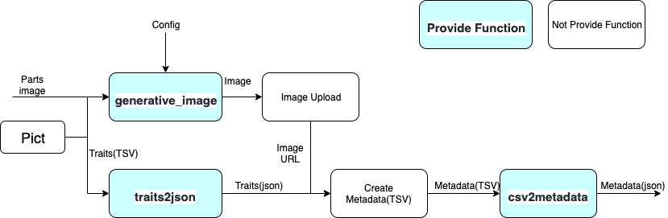

# generative

## Purpose
* Generative image generation from Traits files and part images.
* Metadata generation from Traits files.

## Install
### Require
* Python3
* pip

### Setup
#### Windows
```
# git clone ...
# cd nft-generative
# python -m venv env
# .\env\Scripts\activate
# pip install -r requirements.txt
``` 

#### Mac / Linux
```
# git clone ...
# cd nft-generative
# python -m venv env
# ./env/bin/activate
# pip install -r requirements.txt
``` 

## Usage
* Execution is intended to take place in the source directory
```
# cd ./source
```

### Flow


### generative_image
* Requires a Traits file that defines the Config, part images and part combinations.
* Trait files are intended to be generated in Pict and other formats and need to be tab-delimited

Example
```
# python3 generate_image.py --config=Config/config.yaml --save ./Output/Image
 ```

### traits2json
* Convert each line of a tab-delimited Trait to Json and output in CSV.This is identical to the trait file used in image generation.
* Traits that are present in the image but not reflected in the metadata can be skipped with `--ignore`.

Example
```
python3 traits2json.py --path ./Input/Traits/traits.csv --save ./Output/Traits/traits_json.csv --ignore=backhair
```
### csv2metadata
* Output each line of the metadata CSV file as a separate Json file
* CSV files as inputs need to be created separately, e.g. in Excel.

Example
```
python3 csv2metadata.py --path ./Input/Metadata/metadata.csv --save ./Output/Metadata
```

## Sample
* [config.yaml](./sample/config.yaml)
* [traits.csv](./sample/traits.csv)
* [metadata.csv](./sample/metadata.csv)